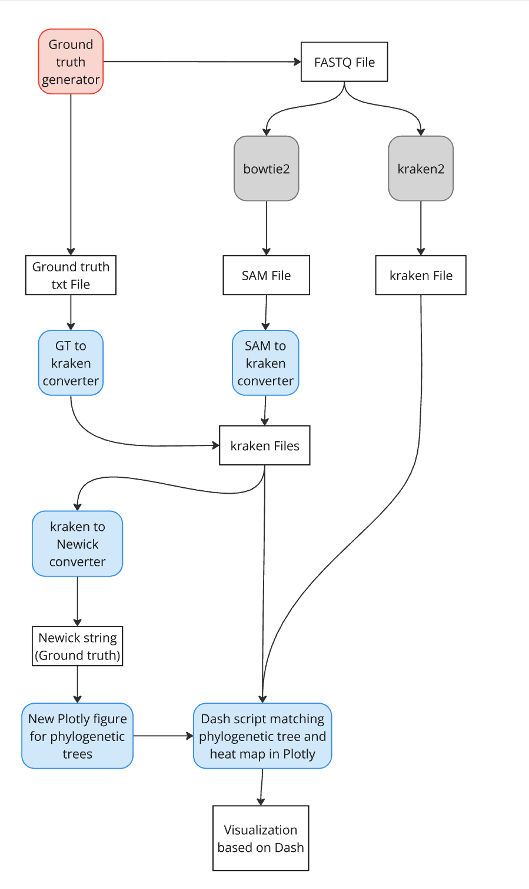

# Genomsequenzierung_WiSe24

Thema: Comparison of Taxonomic Classification Tools for WGS Data

Infos zu Stand nach Sommersemester 2024: [HTW-Cloud](https://cloud.htw-berlin.de/apps/files/?dir%253D%252FProjekt_Genomsequenzierung%252FSoSe_24%2526fileid%253D149475757) (Poster, Präsentation)

## To Dos
-  Skript schreiben, dass aus allen Eingaben einen kombinierten Baum erstellt. Ggf. mit Möglichkeit ein Update aufzurufen, wenn in Dash-App Dateien ein- und ausgeblendet werden.
- **damit Pipeline funktionsfähig wird** GT2Kraken Converter überarbeiten: Indent von 4 auf 2, „all“ auf „root“, „unclassified“ ergänzen, Prozentangaben auf 2 Nachkommastellen limitieren, Namen an wiss. Bezeichnung ohne Publikation anpassen.
- Code cleanup, Bereitstellung der Pipeline als sauberes repository (mit
 README.md, kleiner Testsuite mittels pytest-workflow, Mini-Beispieldatensatz,
 CITATION.cff)
- Anwendung der Pipeline auf einige weitere Datensätze
- Erstellung und Einreichung (bei BMC Bioinformatics oder PLOS One) eines
 Manuskripts

## Aufbau der Nextflow-Pipeline



## Add your files

- [ ] [Create](https://docs.gitlab.com/ee/user/project/repository/web_editor.html#create-a-file) or [upload](https://docs.gitlab.com/ee/user/project/repository/web_editor.html#upload-a-file) files
- [ ] [Add files using the command line](https://docs.gitlab.com/ee/gitlab-basics/add-file.html#add-a-file-using-the-command-line) or push an existing Git repository with the following command:

```
cd existing_repo
git remote add origin https://gitlab.rz.htw-berlin.de/Henriette.Voelker/genomsequenzierung_wise24.git
git branch -M main
git push -uf origin main
```