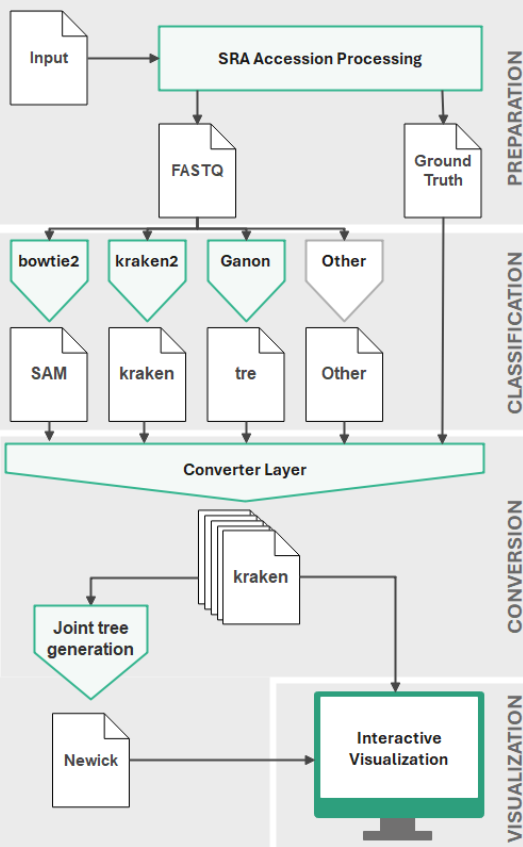

# TACO-NF: Comparison of Taxonomic Classification Tools for WGS Data

This repository contains a **customizable pipeline** that provides a **visual comparison of taxonomic classification tools for whole genome sequencing data**, complementing existing benchmarking studies. The pipeline simulates metagenomic samples by merging real, cleanly sequenced, single-organism data from the Sequence Read Archive (SRA). Users can define a set of organisms and their abundances, which the pipeline uses to generate a ground truth and a corresponding synthetic FASTQ file. The latter serves as input for the selected classification tools. The pipeline includes three pre-configured reference tools (Bowtie2, Kraken2, and Ganon2) and allows users to integrate additional ones. The results are presented in a novel visualization that combines a phylogenetic tree and a heatmap in an interactive web application. This approach provides a visual, non-metric-bound comparison of tool performance. The pipeline offers a flexible, user-oriented solution for selecting and comparing taxonomic classification tools in metagenomic research.



---

## Table of Content

- [Installation](#installation)
- [Run the pipeline](#run-the-pipeline)
- [Integrate an additional taxonomic classification tool](#integrate-an-additional-taxonomic-classification-tool)

---

### Installation

Make sure you have [nextflow](https://www.nextflow.io/docs/latest/install.html) and [singularity](https://docs.sylabs.io/guides/latest/admin-guide/installation.html) installed on your Linux system. You may also use [apptainer](https://apptainer.org/docs/admin/main/installation.html).

Clone the repo and cd into the directory:

```bash
  git clone https://github.com/voelkerh/TACO-NF.git
```

Use Makefile to pull singularity containers from galaxy and build additional python containers:

```bash
  make buildcontainers
  make pullcontainers
```

You can delete or delete and rebuild the containers:

```bash
  make cleancontainers
  make cleanbuildcontainers
```

You can also build containers manually:

```bash
  singularity build python_container.sif python_container.def
  singularity build python_container_plotly.sif  python_container_plotly.def
```

In the next step, download the NCBI taxonomy and accession-to-taxid mapping files, then create a local SQLite database required for taxonomy-based conversion in the pipeline.

```bash
  cd nextflow/conversion/Database/database_utils
  wget ftp://ftp.ncbi.nih.gov/pub/taxonomy/new_taxdump/new_taxdump.tar.gz
  tar -xzf new_taxdump.tar.gz
  wget ftp://ftp.ncbi.nih.gov/pub/taxonomy/accession2taxid/nucl_gb.accession2taxid.gz
  gunzip nucl_gb.accession2taxid.gz
  python3 create_tax_db_file.py create
```

Make sure that **database.db** is correctly located in **nextflow/conversion/Database**, not in a subfolder.
You can test the result using the test.py file provided in the database_utils subfolder.

```bash
  cd nextflow/conversion/Database/database_utils
  python3 test.py
```

---

### Run the pipeline

The pipeline automatically creates a ground truth based on the user input. The input must be provided with a txt-file containing the SRR accession and a number of reads. If bowtie2 is used, reference sequences must be specified. These are accession numbers for reference sequences for organisms provided by NCBI in the RefSeq Database.

Find an [example file here](nextflow/sample_files/pipeline_input/sra_accession.txt)

```txt
# Accession, number of reads, refseq
SRR28741185, 100000, NZ_CP074354
SRR21735255, 2000000, NZ_CP097112
```

Run the pipeline with the example file:

```bash
    nextflow run workflow.nf -profile singularity
```

Run the pipeline with your own accessions file:

```bash
    nextflow run workflow.nf -profile singularity -$(ownFile.txt)
```

You can enable provided classification tools for comparison using one or several of the classification parameters (--kraken2, --bowtie2 and --ganon2).

Run the pipleine with classification tools enabled:

```bash
    nextflow run workflow.nf -profile singularity --kraken2 --bowtie2
```

You can chose from tool-specific options. For kraken2 and ganon2 the database download can be specified (--kraken2_db, --ganon2_db). Moreover, the report type of ganon2 can be specified (--ganon2_report_type).

As the classification tools work with different databases, their outputs (converted to kraken report format) can show inconsistencies. This problem particularly affects intermediate levels that are present in some reports but not in others. If you face inconsistencies in the visualization, you can try to work with --align_taxonomies (default: True). With this parameter you can attempt to align taxonomies by inserting missing parent taxa. This may improve the allover consistency but can introduce new minor inconsistencies in the visualization.

For further information on all available paramterts run:

```bash
    nextflow run workflow.nf --help
```

You can access the interactive visualization in your browser via:

```bash
    http://127.0.0.1:8050/
```

Make sure that the pipeline keeps running in the background, while working with the visualization. To move the elements and explore the visualization use the "Pan" tool and "Zoom in/ Zoom out" in the upper left corner of the visualization area.

---

### Integrate an additional taxonomic classification tool

To integrate an additional taxonomic classification tool for comparison you will need to make adjustments to the pipeline.

- Navigate to the /nextflow/classification directory and create a subdirectory for the tool. Place a new classification workflow here.
- If the workflow requires an additional container, add the reference to the Makefile, place the path in the nextflow.config and use the respective parameter in the workflow.
- Include the new classification workflow in the central workflow.nf. Integrate the output in the concatenation of tool_outputs.
- Check, if the file format of the classification output is supported by the converter layer. You find the respective converters in /nextflow/conversion/to_kraken_converters/converters/. Currently supported: SAM, kraken2 report format, tre. If the required format is not supported, implement a new converter as a subclass of abstract_converter.py and place it in the converters folder.

---

### License

Taco-NF is marked with the MIT License.

---

### Co-Authors

This project was developed at HTW Berlin under the supervision of Prof. Piotr Wojciech Dabrowski. Among others, David Kirchner, Lutritia Dürr, and Kevin Lisse were involved in the project.
